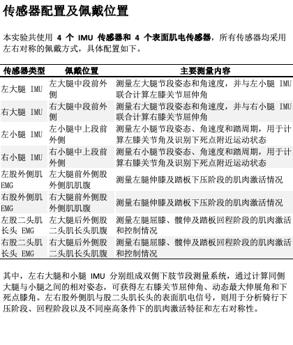

# 场地自行车「出发阶段」测试 —— 实验设计与执行方案

> 用途：本文件用于向场地/队伍工作人员说明实验目的与流程，便于协调**运动员、场地、计时、器材**。
> 一句话：我们想在**出发（起跑）阶段**同步采集「**教练掐表成绩 + 侧面视频 + 肌电/IMU**」，分析**出发姿态（尤其上半身抬起/前冲）与起步快慢的关系**。

---

## 1. 实验目的

- 量化每位运动员出发前几秒的**身体姿态与发力时序**。
- 把**姿态/发力**与**实际起步成绩（掐表）**对应起来，找出「起得快」的动作特征。
- 形成可长期复用的数据与分析流程，供教练复盘、指导技术改进。

对工作人员而言，本次只需协助：**安排运动员、场地时段、出发器/发令、计时**，其余（拍摄、贴传感器、数据处理）由我们负责。

---

## 2. 需要协调的资源（请工作人员帮忙）

| 项目 | 需求 | 备注 |
|------|------|------|
| 运动员 | **5–6 人**，每人出发 **5–6 趟** | 主力/常训练队员优先；能全力出发 |
| 场地时段 | 半天（约 3–4 小时）连续时段 | 尽量减少其他训练干扰 |
| 出发器 / 发令 | 标准起跑器 + 发令（哨/电子） | 与正式比赛一致最好 |
| 计时 | **教练掐表**（起步分段） | 见 §5 计时约定 |
| 扶车/助手 | 1–2 名 | 扶车手穿深色、站车**后侧**，别挡侧面 |
| 场地标线 | 起跑线 + 已知距离标记 | 用于校准与分段（见 §4） |

我方自带：相机+三脚架、肌电/IMU 传感器、标定用具、笔记本。

---

## 3. 实验设计概览

- **对象**：5–6 名运动员。
- **每人趟数**：5–6 趟全力出发（随机安排，趟间充分恢复）。
- **总有效样本**：约 25–36 趟出发。
- **每趟采集**：① 教练掐表成绩 ② 侧面视频 ③ 肌电+IMU（并行，不影响流程）。
- **测试变量**（可选，二选一执行，视时间而定）：
  - **方案 A（先做，最简单）**：全部为"习惯出发"，只求把流程与数据打通。
  - **方案 B（有余力再加）**：每人分两种口令各若干趟——「按平时出发」 vs 「教练指定的技术要求（如：上身压住/积极前冲）」，用于对比。

> 建议**第一次先做方案 A**，跑通流程后再考虑 B。

---

## 4. 现场布置

```
        侧面主相机(严格侧视, 三脚架)
                 │  距起跑线 6~10m, 高度≈髋~胸
                 ▼
起跑线 ├──────── 出发方向 ────────►  距离标记(如15m/30m)
   [起跑器][运动员] →→→
        ▲
   斜前/正面辅相机(可选)
```

- **主相机**：正对侧面，光轴尽量垂直于运动员前进方向；固定三脚架，全程不动。
- **辅相机（可选但推荐）**：斜前 30–45°，看离座与上身动作。
- **标定**：开拍前拍一次已知长度参照物（如 1m 标定杆或车轮直径），并记录起跑线到距离标记的实际距离。
- **同步**：每趟开录后**打一次板（拍手/响板）**，让视频与肌电能对齐到同一时刻。

---

## 5. 计时约定（教练掐表）

为便于和视频对齐，请教练按统一口径计时，每趟至少记录：

- **起步分段**：发令→通过第一个距离标记（如 15m 或 30m）的时间；
- 有条件可加第二个分段（如 0–50m）。

> 只要**每趟都用同一距离、同一口径**即可；具体距离由现场可用标线决定，记下来就行。

---

## 6. 单趟执行流程（约 3–5 分钟/趟）

1. 运动员就位，助手扶车 / 上起跑器。
2. 我方：确认两台相机在录、肌电在采。
3. **打板同步**（拍手一次）。
4. 标准倒计时 → **发令**。
5. 运动员全力出发，骑行通过距离标记（至少 30–50m 或 ~10 秒）。
6. 教练读表报数，我方记录到当趟表格。
7. 备注异常（打滑、扶车早松、未全力等），决定是否重做。
8. 恢复后进入下一趟。

---

## 7. 每趟必记信息（我方负责，工作人员知悉即可）

- 运动员、趟次、口令条件（A/B）
- 掐表成绩（分段时间）
- 视频文件名、肌电文件名、打板时刻
- 器材：曲柄长、齿比、坐/站式起步
- 是否有效（无效原因）

---

## 8. 肌电 / IMU（并行采集，非本次协调重点）

同学负责的可穿戴方案：**4 个 IMU + 4 个表面肌电，左右对称佩戴**。对现场的唯一要求：**贴传感器与做一次标定约需每人 10–15 分钟**，请在每位运动员首次出发前预留。佩戴位置详见下图。



| 传感器 | 位置（左右对称） | 主要测量 |
|--------|------------------|----------|
| IMU ×4 | 左右大腿、左右小腿 | 髋/膝关节角、角速度、踏蹬周期、死点识别 |
| 表面肌电 ×4 | 左右股外侧肌、左右股二头肌长头 | 下压/回程阶段肌肉激活与左右对称性 |

> 肌电不影响出发流程，运动员正常全力出发即可。

---

## 9. 时间预算（半天示例）

| 时段 | 内容 |
|------|------|
| 0:00–0:30 | 布场、相机架设与标定、走流程 |
| 0:30–1:00 | 第 1 位运动员贴传感器 + 试 1 趟 |
| 1:00–3:00 | 逐位运动员正式出发（5–6 人 × 5–6 趟） |
| 3:00–3:30 | 收尾、数据核对备份 |

> 每人正式段约 25–30 分钟（含恢复）。若加方案 B 需相应延长。

---

## 10. 安全与注意

- 全力出发有摔倒风险，扶车与发令按平时规范执行，安全优先。
- 传感器佩戴不得影响动作与安全，如有不适立即停止。
- 数据仅用于训练分析与研究，注意运动员信息保密。

---

## 11. 我们最终会给出什么

- 每位运动员出发的**姿态曲线**（上身抬起/前冲、躯干角、踏蹬相位）+ 叠框视频；
- 与**掐表成绩**对应的对比分析；
- 教练可读的简报，指出「起得快/慢」对应的动作特征与改进建议。

---

## 附：需要工作人员现在确认的事项

1. 可安排的**运动员名单与人数**（目标 5–6 人）。
2. 可用的**半天连续场地时段**（日期/时间）。
3. 现场可用的**起跑器、发令方式、距离标线**情况。
4. 是否可安排**教练掐表**及可用的**分段距离**。
